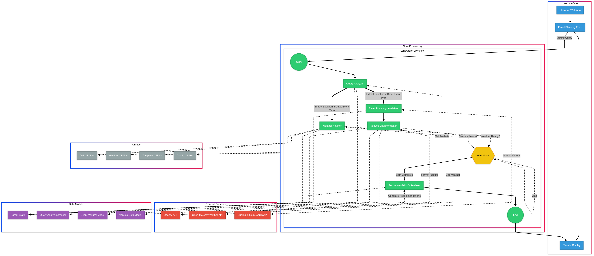

# My Building of Event Planning Agent

Practical Guide : How I Built an AI Event Planner That Plans Better Events Than I Do

## TL;DR
I built an AI-powered event planning Agent that helps users organize events by analyzing weather forecasts, finding suitable venues, and providing customized recommendations. The system uses a modular architecture with LangGraph to orchestrate multiple AI agents working in parallel. The code demonstrates how to create a practical AI application that combines natural language processing, external APIs, and a user-friendly web interface to deliver real business value.

## Introduction:
Have you ever tried to plan an event and found yourself juggling multiple browser tabs? Checking weather forecasts, searching for venues, reading reviews, and trying to make sense of it all? I faced this challenge repeatedly and thought, “There must be a better way.” That’s when I decided to build EventPro AI Planner, an intelligent assistant that handles the heavy lifting of event planning. In this article, I’ll walk you through how I built this system and what I learned along the way.

## What’s This Article About?
This article shows you how I built a complete AI-powered event planning system from scratch. The EventPro AI Planner helps users organize events by:

 - Analyzing natural language queries to understand event requirements
 - Fetching real-time weather forecasts for the event date and location
 - Searching for and evaluating suitable venues based on event type
 - Processing all this information to generate comprehensive recommendations

The system uses a modular architecture where specialized components work together through a state graph. Weather data and venue searches run in parallel for efficiency, while a synchronization mechanism ensures that all necessary information is available before generating final recommendations.

I’ll walk through the key components of the system:

 - The user-friendly Streamlit web interface
 - The LangGraph workflow that orchestrates the AI processing
 - Integration with external services like OpenAI, weather APIs, and search engines
 - Data models and utility functions that support the core functionality

By the end, you’ll understand how to build a practical AI application that solves a real business problem.

Full Article : [https://medium.com/@learn-simplified/my-building-of-event-planning-ai-agent-9b4d355928d0

## Tech Stack


## Architecture




# Tutorial: My Building of Event Planning Agent

## Prerequisites
- Python installed on your system.
- A basic understanding of virtual environments and command-line tools.

## Steps

1. **Virtual Environment Setup:**
   - Create a dedicated virtual environment for our project:
   
     ```bash
     python -m venv My-Building-of-Event-Planning-Agent
     ```
   - Activate the environment:
   
     - Windows:
       ```bash
          My-Building-of-Event-Planning-Agent\Scripts\activate        
       ```
     - Unix/macOS:
       ```bash
       source My-Building-of-Event-Planning-Agent/bin/activate
       ```
   

# Installation and Setup Guide

**Install Project Dependencies:**

Follow these steps to set up and run the  "My Building of Event Planning Agent"

1. Navigate to your project directory:
   ```
   cd path/to/your/project
   ```
   This ensures you're in the correct location for the subsequent steps.

2. Install the required dependencies:
   ```
   pip install -r requirements.txt   
   ```
   This command installs all the necessary Python packages listed in the requirements.txt file.


# Run - Hands-On Guide: My Building of Event Planning Agent
  
   ```
   streamlit run main.py
   ```
   
## Closing Thoughts
The future of AI in business isn’t about replacing human workers — it’s about augmenting them with tools that handle routine information processing so they can focus on creativity and relationship building.

As large language models continue to evolve, we’ll see AI assistants that can maintain context over longer periods, incorporate more diverse data sources, and provide increasingly nuanced recommendations. The next generation of business AI tools will likely feature:

- Multi-modal interactions combining text, voice, and visual elements
- Deeper integration with business systems and databases
- More sophisticated reasoning that explains not just what to do but why
- Personalization based on past interactions and preferences
- Proactive suggestions that anticipate needs before they’re explicitly stated

Businesses that start implementing practical AI solutions today will be better positioned to adopt these advanced capabilities tomorrow. The approach demonstrated in this article — combining existing AI services with custom workflow orchestration — provides a solid foundation that can evolve as technology advances.

The most exciting developments will come from domain experts working alongside AI specialists to create systems that truly understand the nuances of specific industries. By starting with focused applications like event planning and gradually expanding their capabilities, businesses can build AI assistants that become increasingly valuable partners to their human teams.
